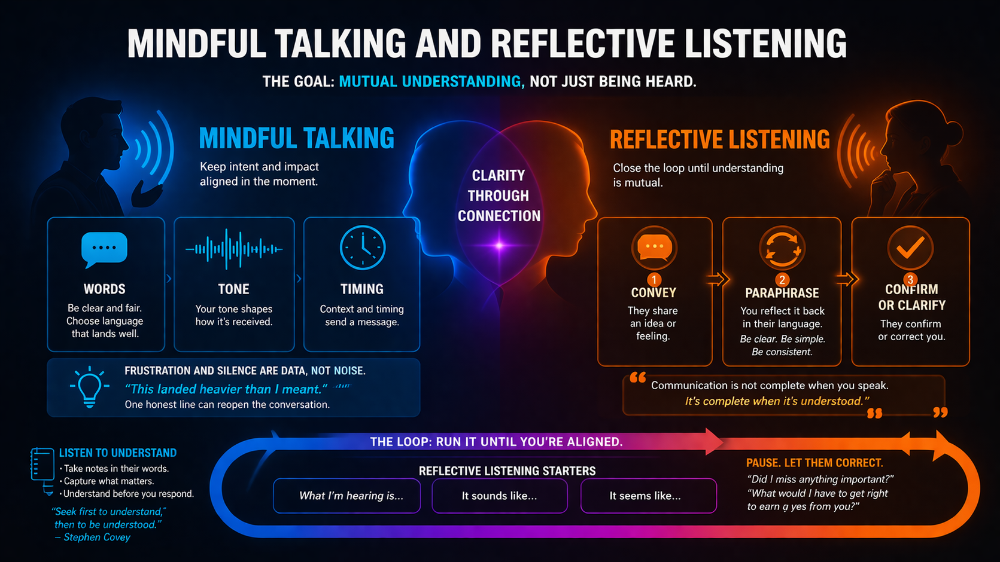
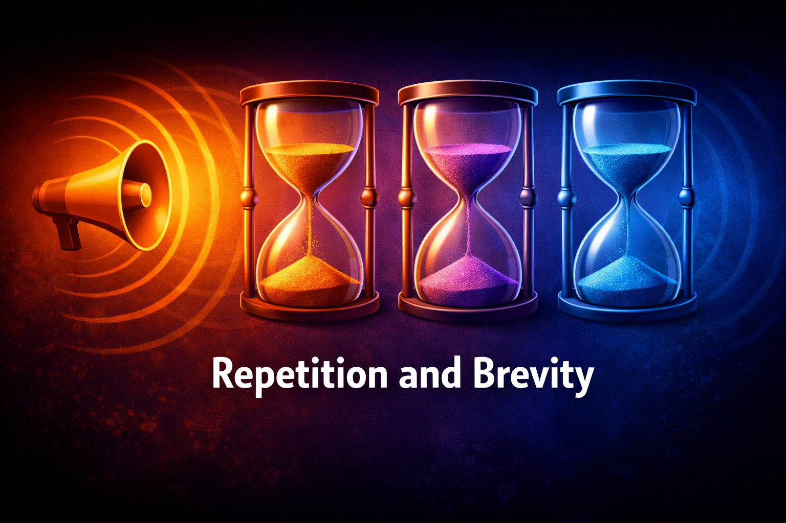

# Clear Communication

## Why this matters in a company

Almost everything a leader does that other people can act on travels as communication. Strategy, priorities, trade-offs, risk, and timing do not exist for the organization until they show up in what gets said, written, scheduled, or reinforced. In a corporate setting you rarely share a physical war room with everyone who needs to align. People sit in different functions, time zones, and incentives. Information does not disseminate evenly on its own.

It moves through channels that are easy to underestimate: staff meetings and town halls, team forums, written updates and dashboards, chat and email, 1:1s, reviews, and the quiet signals of what gets asked about in the hallway or what never gets followed up on. Formal broadcasts reach many people at once but often lack nuance. Informal loops fill in context but can fragment the story. Leaders who do not design how information flows end up with a patchwork where some teams are over-informed, others operate on rumor, and everyone wastes energy reconciling different versions of reality.

Clear communication is not polish or charisma. It is how you reduce the gap between what you intend and what the organization can actually execute on. Without it, coordination fails, decisions get relitigated, and good intent does not survive contact with the floor. This chapter treats communication as a system you operate on purpose: how meaning travels, how you close the loop, and how you choose the channel for the job.

## Communication as a system

Communication is not a moment. It’s a system.

A system has inputs and outputs that stay coupled over time. What you say once is an input. What people believe, prioritize, and do with the information is the output. In a company those two drift apart unless you run tight feedback loops: you see what landed, you correct, you repeat in the right venues, and you watch whether behavior changed. Treating communication as an event (“we announced it”) hides the work of keeping intent and execution connected.

Every organization leaks meaning. Messages get repeated, which is good, but each repetition is also a chance for distortion. Meaning decays as people summarize for their teams or translate for their dashboards. Gaps get filled with assumptions that usually favor fear or optimism over accuracy. Your job is not to eliminate that entirely. It is to expect it and design against it.

That is why the measure of clarity is not eloquence. It is whether the organization can act in rough alignment without you restating the whole story every hour. If you are not at least a little tired of repeating the same trade-off, your team has probably not internalized it yet. They may have heard the words, but they have not absorbed the constraint that should guide their choices when you are not in the room.

Clarity is not what you say once. It’s what people hear (and what they keep hearing), not only what you said in the room.

When you see communication as a system, the rest of this chapter has a place to land. Intent and impact are how you debug the loop. Mindful talking and reflective listening are how you verify output. Naming what you know, trade-offs, and the type of conversation are how you keep inputs honest. Channels are where you route signal. Repetition is how you fight decay without becoming noise.

## Intent, action, and impact

The point is to close the loop until understanding is mutual, not until you have finished talking.

Most communication breaks here.

Leaders speak from intent. Teams react to impact.

Those eight words are the whole asymmetry: one side has the full story in mind, the other gets only what you did, said, and signaled. Everything below is unpacking that gap.

You carry intent inside your head: what you meant, how urgent this really is, how much room there is to push back, whether you are worried or calm. Nobody else has access to that directly.

What they get is impact, and impact rarely comes from your words alone. It comes from how verbal and non-verbal cues combine in real time. The literal content of what you say matters, but so does pace, timing, and tone in conversation, whether you make eye contact when someone challenges you, how long you wait before you answer a hard question, and whether your body language matches “I’m open to input.” In writing, “non-verbal” shows up as structure, length, who is on the thread, how fast you reply, what you do not address, and whether follow-up ever arrives. In the broader pattern of how you lead, people also read what you reward in public, which meetings you skip, and what you have energy to revisit. They assemble those signals into one experience. Your impact is that composite story, not the tidy version you composed beforehand for yourself.

There is a pop-culture line about people speaking different languages on different planets; the corporate twist is sharper than it should be. Managers are from Mars, employees are from Venus. On Mars, intent, trade-offs, and pressure mostly live in your head and in rooms employees never see. On Venus, people get the combined signal of what you said, how you said it, and what you did next. They have to decide and deliver without your interior monologue. Nobody is wrong for living on their own planet. Misalignment is what happens when no one does the translation work: checking what landed, naming mixed cues, and closing the loop until both sides share the same picture of reality.

The gap between intent and impact often opens right there in the mix. You write an email you intend as neutral; short sentences and no greeting land as cold. You intend to keep the door open for debate, but you rush the last five minutes of the meeting and close your laptop while someone is still talking, so people hear a decision already made. You intend to buy time; they see missed deadlines and no narrative, so they hear abandonment. You intend to empower; you stop showing up in the forums where trade-offs get visible, so they hear absence. None of these require bad faith. They only require unstated intent, mixed cues, and busy schedules.

Closing the gap is not the same as over-explaining or repeating yourself in a louder voice. It is making understanding mutual. You say what you mean as cleanly as you can, then you verify what people took from it before they execute, stall, or spread a wrong summary. You are checking the output of the system, not congratulating yourself on the input. The habits that make that verification real, not performative, are what the next section takes up.

Your job is not just to say things clearly. It’s to stay with the conversation until impact matches intent well enough that people can act. That takes explicit loops and the kind of listening that earns the other person’s version back, not another monologue.

## Mindful talking and reflective listening

These habits matter most when you are actively aligning with someone, not when you are only broadcasting.

The two jobs are different. Mindful talking is how you keep intent and impact as close together as this moment allows: what you mean, and what actually lands, should match as well as you can make them through words, tone, timing, and presence. Reflective listening is how you close the loop: you play their idea back in consistent, clear, simple words, they confirm or correct you, and you run that cycle until understanding is mutual. The point is steady signal, not a clever new frame every round.

### Mindful talking

That intent-and-impact work is mostly visible in words, tone, and timing. People fuse what you say with how you sound and when you say it: language that is fair on paper can still land as cold or dismissive if your voice is rushed or your attention is elsewhere. Timing is not neutral either. A no-context “let’s sync” when everyone knows the subtext is conflict is its own message. When you can offer something steadier instead (“tomorrow, thirty minutes on X, nothing hidden”), people often bring more thinking and less armor. Frustration and silence are data, not noise to steamroll. You do not need to therapize the room. One straight line about what is live can be enough to reopen the conversation: “This landed heavier than I meant.” Stay on the problem after that, and do not rush to fill every pause while someone is reaching for a harder sentence.

None of that lands if you are sloppy about attention while they are talking. What follows is the listening discipline that has to be in place before reflective listening can work.

People don’t hear what you say. They hear it through their context, their biases, and what they’re worried about.

If you want one line that cuts through most bad listening habits, Stephen Covey’s is hard to beat:

> Most people do not listen with an intent to understand, they listen with an intent to reply.

Stephen Covey

Listening with an intent to reply means you are already composing your counterpoint, your fix, or your story while the other person is still talking. You catch a keyword, latch onto it, and wait for airtime. You may look patient on the outside while your inner debater is on stage. Listening with an intent to understand is slower. It means you are using their words to update your picture of what they think is true, what they fear, and what would count as a good outcome for them. You can still disagree afterward. First you have to see the same situation they are seeing, or you are not in the same conversation.

One habit that keeps you in the second mode is taking notes as they talk. Not minutes for the archive, but short phrases in their language: the words they reach for when something matters, the constraint they name twice, the fear they tuck inside a joke. Writing it down slows your reflex to jump in. It is evidence that you are collecting their reality, not rehearsing yours. Later, when you paraphrase back, you can lift their vocabulary on purpose. People feel heard when the echo sounds like them, not like a clever summary from you.

Notes also help after the meeting. Internalizing what someone said takes longer than the calendar block. When you skim what you captured, ask whether you actually understand or only recognized the topic. If the phrases look thin, that is a signal you were already solving in your head. If they are specific enough that you could explain the other person’s position to a neutral third party, you are closer to shared ground before you move the work forward.

A useful image is a sponge: take in what they are offering before you wring out your own take. Absorbing is not the same as agreeing. It is holding their meaning long enough that you do not swap in your headline while they are still trying to be precise.

That posture overlaps with another shift worth holding onto:

> Be more interested in understanding than in making yourself interesting with the fast answer.

Sometimes the sharp insight really is what the moment needs. In alignment conversations it often short-circuits learning anyway. People stop because it no longer feels safe to keep going, or because you signaled you already “got it” when you only got the headline. Curiosity is disciplined restraint until their picture is clear enough that you can disagree with a reality you both recognize.

### Reflective listening

This is the loop-closing half: listening turns into language you give back to them, so together you can verify what was meant.

Communication is not complete when you speak. It’s complete when it’s understood.

Reflective listening closes that gap in real time. The shape is simple: someone conveys an idea or a feeling; you paraphrase what you took from it without grabbing the spotlight; they confirm or correct you. The loop runs again until you are aligned enough to act or disagree with clarity. When you paraphrase, stay with the same core message each pass: consistent, clear, simple language beats a flashy rephrase that sounds like you changed the substance. Your job in the middle step is not to sound clever. It is to make the other person’s meaning visible enough that they can say, “Yes, that’s it,” or “No, the part that actually matters is…”

Starters that invite correction instead of debate:

What I’m hearing is…  
It sounds like…  
It seems like…  

When the stakes are emotional and they have earned that intimacy, sometimes “you feel like…” lands better than a cold summary. Use it when you are genuinely checking, not when you are labeling them.

After you paraphrase, pause. Let them fix you. If they only nod, ask a boring useful question: “Did I miss anything important?” or “What would you add?” Confirmation is the payoff. Without it, you only performed listening.

## Say what you know

People can’t align on what they can’t see. State the picture out loud: facts, gaps, and what happens next. You don’t need perfect answers. You need to orient them without pretending certainty you don’t have.

Make three things explicit.

- Knowledge: here’s what we know, what we don’t, and what we’re doing next.
- Trade-offs: what you’re prioritizing and what you’re giving up. Avoid false confidence when the cost is real.
- Type of conversation: label the moment so no one guesses the rules, whether this is a discussion (explore), a decision (commit), or direction (here’s how we’re moving).

If you skip any of these, people fill the gap with rumor, fear, or optimism. Naming them is how you keep inputs honest.

## The right channel for the job

Match the medium to the job: nuance, psychological safety, and real-time repair don’t all survive email. Pick for what people need, not only for what is easy for you.

| Channel | What it’s for |
|--------|----------------|
| 1:1s | Ambiguity, hard feedback, and what won’t be said in a crowd. When they go missing, you lose early signal and trust erodes in quiet. |
| Team forums and meetings | Shared direction, visible trade-offs, and one story everyone heard the same way. |
| Written updates | Scale, time zones, and a record people can reread. |
| Short video | Tone and intent when the team is distributed and text keeps landing flat. |

Choose the channel for the job, not only for your comfort.

### How I make the signal understood

When people aren’t hearing you from the same room at the same time, I keep the idea from drifting by routing it through a few predictable venues, each doing a different job:

- Regular 1:1s with direct reports, skip-levels, and stakeholders outside your immediate team to test what actually landed
- AMAs so questions surface in the open and misunderstandings show up early
- In 1:1s, check whether what you said in a public forum landed; adjust the next pass
- Written status updates on important work, shared with the people who need a stable record
- A monthly or bimonthly newsletter when the story needs a steady beat
- Restate the same position in another org’s town hall or all-hands when alignment has to cross boundaries
- Exec partners who can echo the company-wide line when your reach isn’t enough

## Repetition and brevity

Repetition here is not volume for its own sake. It is returning on purpose to the same core idea: the trade-off, the direction, the constraint people need to carry when you are not in the room. You say it again in different settings and with fresh examples so the organization can absorb what one announcement rarely installs.

The first time, people hear it. The second time, they recognize it. Only after repeated exposure, across different contexts, do they begin to internalize it.

Even then, the system keeps degrading the signal. Once a message leaves you, people summarize it, translate it for their team, and pass it along. Each hop is a chance for drift. So you repeat with discipline: same substance, tuned for the audience, not a new tagline every month only for freshness. That is how repetition steadies the signal instead of piling noise on noise.

Brevity belongs in the same stack. Repetition is not permission to be long-winded. If the spine of the message is not short enough to remember, it will not survive the next summary anyway, and people will tune out before the core idea lands. Say less per pass; use the room for examples and questions, not for six priorities at once. Repetition spreads the idea across time and place. Brevity keeps each pass bearable and repeatable. Neither one replaces the other. Together they are what lets good communication travel.

If you are not at least a little tired of restating the same trade-off, people have probably heard the words without absorbing the constraint. One broadcast does not fix that. Clarity is what people keep hearing in the forums where they actually decide, not only what you said once in the town hall.

Run the stable signal through the channels you already chose for the job. Team meetings, 1:1s, reviews, written updates. Adapt examples and emphasis; keep the trade-off and the direction honest. When leaders rewrite the story too often for momentum, teams burn energy reconciling versions instead of executing. That is how signal turns into confusion at scale. Used this way, repetition is reinforcement, not redundancy: it is what lets an idea survive interpretation and time.

You know it is working when people can predict your question, say the constraint back in their own words, and when decisions made without you still reflect the same reasoning. That is alignment, not everyone repeating your slogan.

None of that is a single heroic announcement. It is the same loop, turned many times: stay honest about what you know and what you cost; talk and listen so intent and impact stay close; route meaning through channels that fit the work; repeat with discipline and brevity so the idea survives retelling. The chapter is built so those pieces stack. Under pressure, you reach for the whole stack, not one trick.

## Closing

Good communication is not about saying things once. It is shared understanding that still works when you are not in the room: people know the trade-offs, close loops with each other, and act on a story they did not have to invent from a single email or one tense meeting.

Clarity isn’t when you’ve said it. It’s when others start saying it for you.
