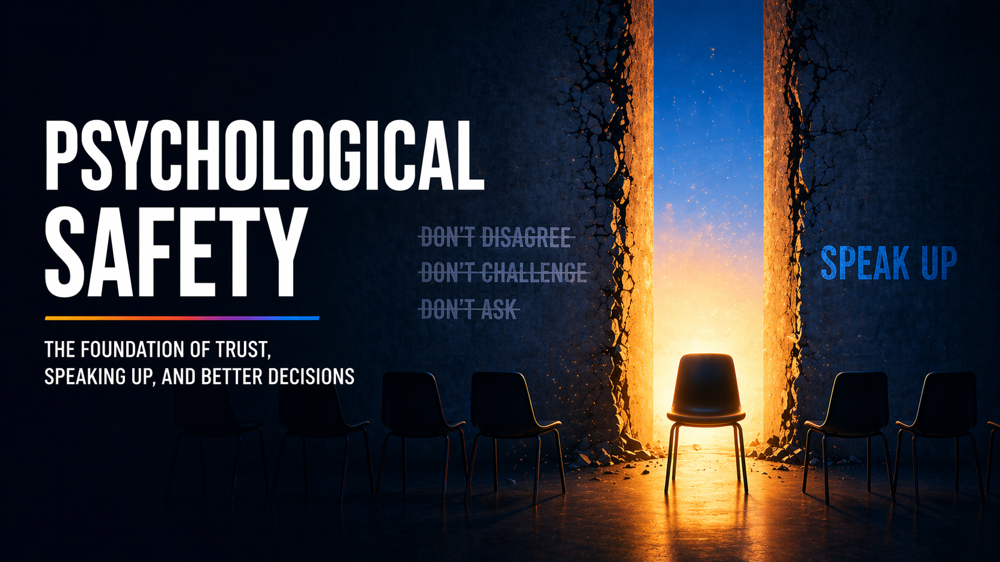
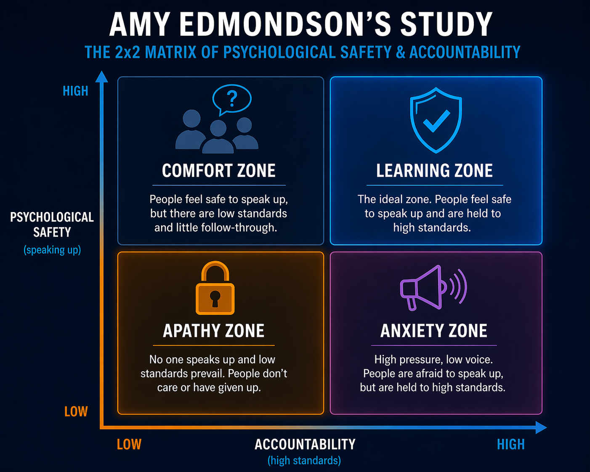
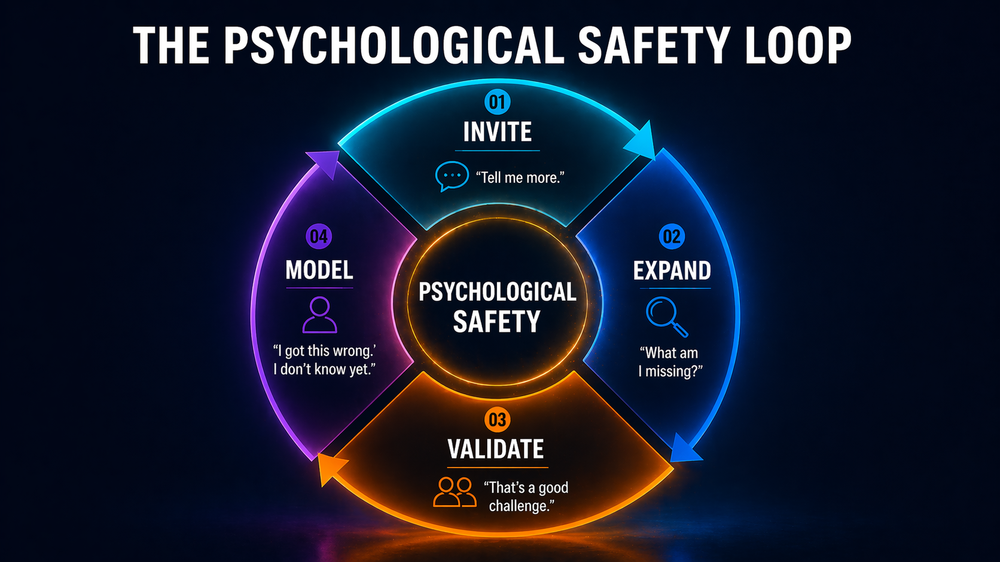

## Psychological safety

### What this actually is

Psychological safety is the shared belief that you can speak up without paying for it.

When it is present, people take those risks in the open. They ask, push back, and name what is unclear, because the downside of honesty feels smaller than the cost of staying quiet. Problems get named while they are still small. Assumptions get tested before they harden into plans. The team learns in public instead of repeating the same blind spots in private. You get fewer surprises, less rework, and decisions people can actually stand behind.

When it is missing, the same people still notice the same problems, but they weigh whether speaking up is worth it, and often decide it is not. The cost is invisible at first. The work moves and the calendar fills. Nothing looks wrong until a flaw everyone half-saw compounds into failure, rework, or a decision no one really believed in.

It is not about being nice. It is not about avoiding conflict. It is not about making people comfortable. A team can be polite and still be silent, and a silent team is a dangerous team. What you are really creating is permission to take interpersonal risk in front of others.

Psychological safety is not about how people feel in general. It is about what they are willing to do in moments that carry risk.

### The balance that matters

Psychological safety on its own is not the goal. Amy Edmondson, who named and studied this idea, is careful on this point, and it is worth repeating: safety is not about lowering the bar. It is about raising what people can say while the bar stays high.

The easiest way to see this is to put safety and standards on two axes, as expained by Amy. Every team sits in one of four zones.

**Apathy zone: low safety, low standards.** Nobody pushes, nobody is expected to. People coast, good ones leave, the team quietly decays.

**Comfort zone: high safety, low standards.** People like each other and speak freely, but nothing improves. Deadlines slip, feedback softens, excellence is optional. Feels healthy from the inside.

**Anxiety zone: low safety, high standards.** The bar is high, but the cost of being wrong is higher. People perform, hide mistakes, and stop saying "I don't know." Looks like excellence until the best people leave.

**Learning zone: high safety, high standards.** People speak early, challenge directly, and are still held to a real bar. Problems surface while they are small. Disagreement is part of the work.

You do not drift into the learning zone. Teams default to comfort or anxiety, depending on which side the leader is more afraid of. Too afraid of conflict, and you slide into comfort. Too afraid of slipping, and you grip your way into anxiety. Both feel responsible in the moment. Both cost you later.

The learning zone is maintained, not declared. You reinforce both sides at once—openness *and* expectation, candor *and* accountability. Remove either side, and the system drifts to the nearest lower zone.

### The signal you're missing

Most leaders believe their teams feel safe. There is a simpler way to test that belief than any survey.

Think about the last few meetings where something important was decided. Not status updates, but moments where direction, tradeoffs, or risk were on the table. Did anyone disagree with you directly, in the room? Did someone say "I think this might not work" or "we're missing something here"? Did anyone admit "I don't know" without softening it first?

If the answer is no, that is not alignment. The absence of conflict is apathy, and this is filtering.

Silence is rarely agreement. It is calculation. People are deciding, in real time, whether speaking up is worth it. "Will this land badly?" "Is it safer to stay quiet?" If that calculation consistently ends in silence, the team is not safe, regardless of what is said about the culture.

Over time, the calculation becomes habit. Small concerns go unspoken. Assumptions go unchallenged. Problems surface later, when they are harder and more expensive to fix. The system looks stable until it suddenly isn't.

You don't measure the health of a team by what is said. You measure it by what never gets said at all.

### The Psychological Safety Loop

The opposite of silence isn't speaking. It is a pattern the team can run on itself. Four moves, repeated until they stop being yours alone.

**1. Invite — "Tell me more." "Say more."**
Signal that there is room for the full version of what someone is trying to say, not just the cleaned-up summary.

**2. Expand — "What am I missing?" "What are we not thinking about?"**
Put your own limits on the table first. That makes it cheaper for everyone else to do the same, and shifts the frame from *defend the plan* to *pressure-test the plan*.

**3. Validate — "That's a good challenge." "Thanks for flagging it early."**
Reward the act of speaking before you respond to the content. The person who just took a risk learns that going first isn't punished. The rest of the room learns it too.

**4. Model — "I got this wrong." "I don't know yet."**
Go first on the hardest things. Asking others to admit uncertainty or mistakes while never doing it yourself doesn't hold. The cost of honesty has to be paid at the top of the room first.

These aren't separate tools. Invite opens the door. Expand pulls more in. Validate keeps the door open. Model lowers the bar for who has to go first next time. Run this pattern consistently and the loop stops being yours alone — the team starts running it on each other.

### Where it really comes from

Psychological safety is not a team trait. It is a leadership signal.

People read that signal in two streams at once: the words you use, and what your body and attention are doing while you use them. Both have to agree, or the room believes the quieter one.

Much of the work is non-verbal. Who you look at when a question is asked. Whether you turn toward the person pushing back or away from them. Whether your face changes when the news is bad. Whether you keep typing while someone is talking. Whether you let silence sit long enough for the quieter people to step in, or fill it yourself. Whether your tone tightens the moment you are challenged.

People track all of this, even if they can't name it.

A few moments that matter:

In a review, someone says a date is going to slip. You say "thanks for flagging it early, what do you need," and you mean it. You don't sigh, and you don't pivot to blame. The rest of the team just learned that bad news is still safe to bring.

Someone disagrees with your position in front of peers. You say "say more," ask one clarifying question, and acknowledge the part they got right before you respond. The room learns that pushing back on you is not a career-limiting move.

You realize mid-meeting that your own framing was off. You say so, out loud. "I got this wrong." Nobody needs you to be perfect. They need to see that you will correct yourself in public.

A new person on the team gives an incomplete answer. You don't finish the sentence for them. You give them the extra few seconds. The next time they have a half-formed idea, they are more likely to try it.

None of these are scripts. They are evidence. In my meetings, I practice them regularly.

People don't decide once if it is safe to speak. They watch what happens when someone disagrees with you, when someone says "I don't know," when something breaks. Those moments teach the system more than any statement ever will.

Every team settles at the level of honesty its leader can handle.

### What it costs, and what it rewards

One framing I use with my team: "Give me the maximum information in this room, so I can defend it for you in rooms you are not in." That is the deal. If a risk has been softened or a concern has been held back, I end up defending a version of reality that is not true. That helps no one.

Psychological safety is rarely lost in a single moment. It erodes in small, repeated reactions. A dismissive comment. An interrupted thought. Asking for input and ignoring it. A visible reaction to being challenged. Subtle impatience when someone is still forming a point.

Once people recalibrate, behavior changes quickly. They speak less and filter more. They wait until they are sure, or they say nothing at all. The conversation becomes smoother, but thinner.

Fear does not usually show up as tension or conflict. It shows up as politeness. And once a team becomes polite, it becomes slow.

What you reward is the loudest signal. When people raise risks early, ask for help, challenge assumptions, or surface problems before they grow, your response teaches the team what is valued. What you do not punish carries almost as much weight. Honest mistakes, incomplete thinking, and dissent that improves the outcome must not carry a hidden cost later. No cooler tone. No quiet exclusion.

And there are behaviors you shut down immediately. Ridicule, defensiveness, passive aggression, ignoring input after inviting it. Tolerating them once is a signal. Tolerating them twice is a policy.

### When you are not the one setting the weather

Most writing on psychological safety assumes you are the one at the top. For many readers, that is not the situation.

You may be running a team inside a larger system that does not reward the behavior you are trying to model. You ask "what am I missing?" and your own manager reads it as indecision. You admit a mistake in public and watch it resurface in a performance conversation six months later. You push back in a skip-level and the room cools around you.

You cannot fix that system from where you sit. What you can do is hold the line for the people who report to you. You can absorb the cost of honesty at your level instead of passing it down. You can defend the person who flagged the risk, even when the risk is inconvenient. You can be the layer where the signal does not degrade.

It is harder. It takes more energy. And it is the actual job.

### The standard you set

Psychological safety is not something you declare. It is something people experience.

It shows up in how quickly someone is willing to challenge you. In how early a problem is raised. In whether people admit uncertainty before it becomes failure.

Safety does not start when people feel brave. It starts when the cost of speaking drops low enough that they no longer have to be.

Your job is to carry that cost so the team doesn't have to.